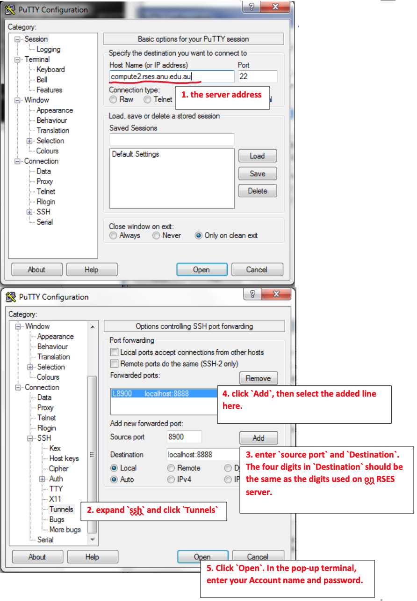
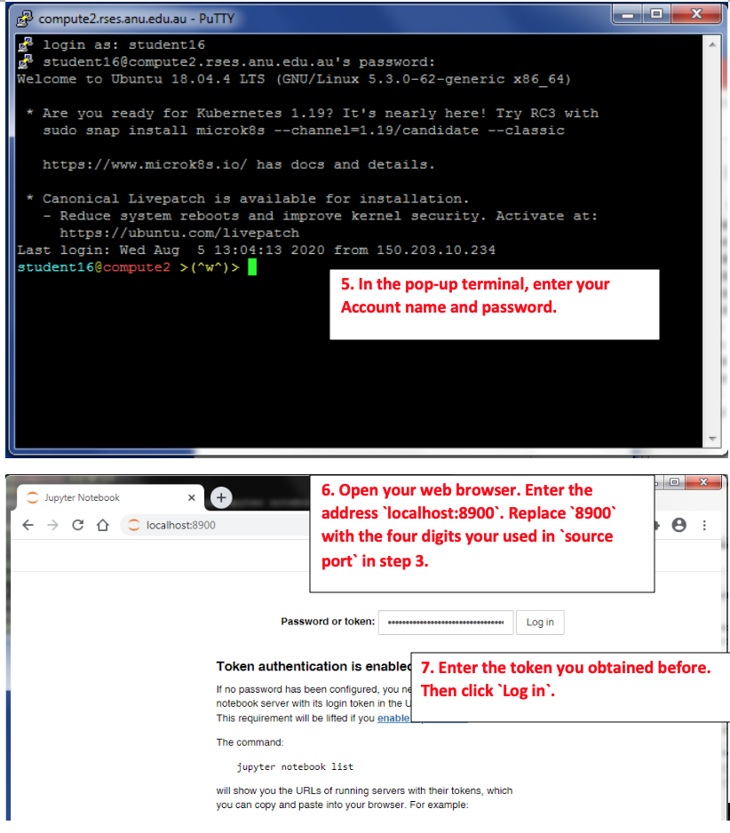

Connect to Remote Jupyter Server from your computer
============

# 1. From window

### Step 1
Login to RSES server as you did in week 1.
In the terminal, install *Jupyter* by
```bash
pip3 install --user notebook 
```
After the installation, run the *Jupyter* by
```bash
~/.local/bin/jupyter notebook --no-browser --port=8888 & 
# please use another four digits for 8888, e.g., 8889, to avoid conflicts between different users.

~/.local/bin/jupyter notebook list
# You will find a `token` string, you will need it latter.
# Here an example: `http://localhost:4567/?token=5db15721f2136765a365791547a1b5c2f07b06d005c239c2 :: /home/seis/sheng`,
# the token is `5db15721f2136765a365791547a1b5c2f07b06d005c239c2`. 
```

### Step 2
In your local computer (Windows system). Follow the sub-steps below





# 2. From MacOS or Linux

### Step 1
Login to RSES server as you did in week 1.
In the terminal, install *Jupyter* by
```bash
pip3 install --user notebook 
```
After the installation, run the *Jupyter* by
```bash
~/.local/bin/jupyter notebook --no-browser --port=8888 & 
# please use another four digits for 8888, e.g., 8889, to avoid conflicts between different users.

~/.local/bin/jupyter notebook list
# You will find a `token` string, you will need it latter.
# Here an example: `http://localhost:4567/?token=5db15721f2136765a365791547a1b5c2f07b06d005c239c2 :: /home/seis/sheng`,
# the token is `5db15721f2136765a365791547a1b5c2f07b06d005c239c2`. 
```

### Step 2
Then, open the terminal on you local/client computer. Search for and run `terminal`. Run the following command in your terminal:

```bash
ssh -N -f -L localhost:8900:localhost:8888 your_account_name@compute2.rses.anu.edu.au
# Note! 8888 here is same as the one you used when running Jupyter. 
# If you use another digits, please change it here accordingly.

# Note! 8900 is the four digits you will use latter.

# Note! Replace `your_account_name` with your account name. You need to provide your password here.
```

Then, open a web browser, type the address `localhost:8900`. Note, `8900` here should be the same as you use above. If you use another digits, please change it accordingly. In the webpage, enter the *token* you obtained before and then login.


